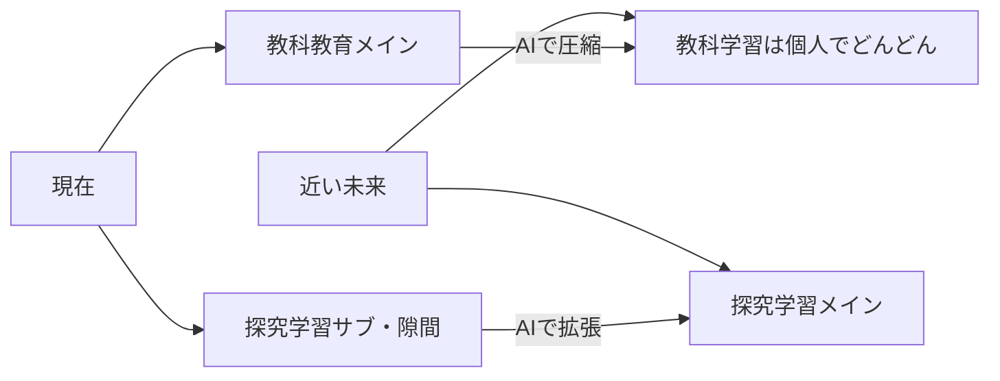
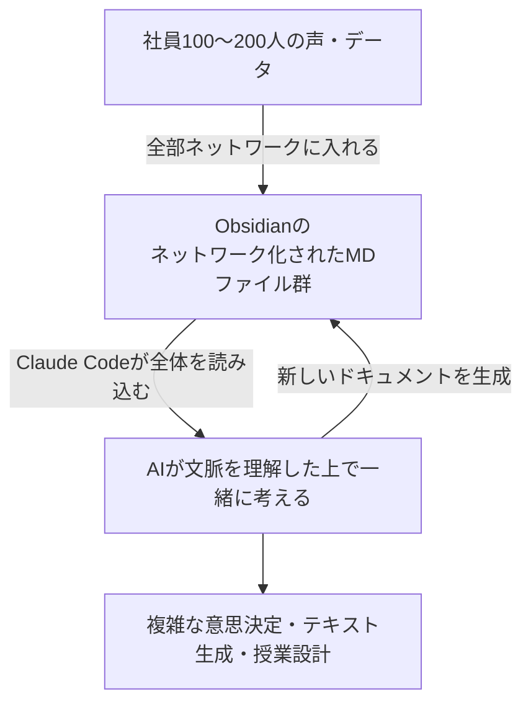
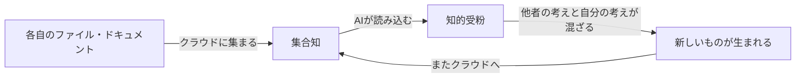

---
tags:
  - かえつ有明
  - AI研修
  - 両利きの学校
  - 両利きのAX
  - 探究学習
  - 創発・集合知
  - AIチューター
  - 反転授業
  - 個別最適化
  - ジャストインタイム学習
  - ClaudeCode
  - テクニカルファシリテーター
  - AI×教育
created: 2026-03-30
updated: 2026-03-30
---

- [ ] 確認

# かえつ有明 AI研修 第3回レポート【記録中 🔴LIVE】

> **日時：** 2026年3月30日（月）09:00〜
> **形式：** Zoom オンライン研修
> **ファシリテーター：** 田原さん（コンテンツ）× 北田朋也（テクニカル）
> **テーマ：** 両利きの学校 × AIチューター × ジャストインタイム学習
> **シリーズ：** AI時代の反転授業三本柱（全3回）最終回

---

## 全体の流れ（記録中）

| 時刻 | 内容 |
|------|------|
| 09:03 | チェックイン |
| 09:10 | 本題①：両利きの学校（教科教育 vs 探究学習） |
| 09:15 | 本題②：両利きのAX（効率化 × 創発・集合知） |
| 09:19 | ワーク①：「今一番忙しいこと」フォーム入力 |
| 09:25 | 北田事例：あおいカレッジ（やめるから始まった探究） |
| 09:28 | 田原事例：予備校時代の自己DX |
| 09:32 | フォーム回答まとめ・AI効率化領域の分類 |
| 09:36 | 本題③：AIチューターとは（カーンアカデミー・カーミーゴ） |
| 09:39 | 「何でもAIチューター」Gem ライブデモ（熱力学） |
| 09:42 | AIによるテキスト自動生成の可能性 |
| 09:45 | ワーク②：「何でもチューター」Gem 15分体験 |
| 10:00 | ブレークアウトセッション：「授業デザインはどう変わるか」 |
| 10:17 | グループ発表・全体ディスカッション |
| 10:36 | 発展：ジャストインタイム学習・Claude Code × Obsidian |
| … | （随時更新中）|

---

## 参加者チェックイン（09:03〜09:10）

| 参加者 | 前回からのアップデート |
|--------|----------------------|
| 高田美喜さん | AI研修で「身近になった」。どう使えばいいか具体的に考えるようになってきた |
| 大木理恵子さん | 岩井先生・石田先生と一緒に**メール返信用のGemを自作・活用**中 |
| 上野愛さん | 「投げかけ（プロンプト）で結果が変わる」と実感 |
| 石田記子さん | Geminiを「道具として接する」に意識変容。AIを知るかどうかで時間の使い方が全然変わると痛感 |
| 山田秀男さん | 言語学・英語教育エキスパートとして設定してGeminiに壁打ち。「読み込ませるもので差が出る」と体感 |
| 佐野和之さん | 授業への応用を学びたい |
| 立川さん | 第2回欠席。今日は新しいことを学びたい |
| 小島さん | 今回初参加。楽しみにしていた |
| 高倉さん | 今回初参加。ライトの使い方を学びたい |
| 岩井先生（チャット） | 教員・生徒のリテラシーをいかに育むか頭を悩ます毎日 |
| 北田朋也 | 2回の実践を経て、リアルタイムで統合・アウトプットする「新しい研修の仕方」が見えてきた |

---

## 本題①②：両利きの学校 × 両利きのAX（09:10〜09:19）

```
既存事業（活用） = 教科教育    新規事業（探索） = 探究学習・PBL
     ↓                                ↓
AI効率化・自動化で省力化     集合知・創発に人間の時間を集中
              ↓
    「何を減らして何を増やすか」が鍵
```

---

## ワーク①回答まとめ & AI活用分類（09:32〜09:36）

| 忙しさのカテゴリ | AIで効率化できるか |
|-----------------|------------------|
| ルーチンワーク（記録・集計・連絡） | ◎ 劇的に削減可能 |
| 個別添削の一次受け | ◎ AIチューターで代替可 |
| 生徒・保護者との対話とケア | △ 人間が時間をかけるべき |
| 組織の文化づくり・価値観の統合 | △ 人間が時間をかけるべき |
| 創造的なカリキュラム設計 | △ 人間が時間をかけるべき |

> **反転授業の発明者バーグマン：**「反転授業で一番嬉しかったのは生徒同士・生徒と教師・教師同士のコミュニケーションが改善したこと」→ AIでも同じことが起きる。

---

## 事例①：あおいカレッジ（北田朋也）（09:25〜09:27）

若手教師の「クラブ活動、子どもたちイキイキしてなくないですか？」の一言 → クラブ廃止 → **あおいカレッジ（探究学習）にシフト**。「やめる」から始まった改革。

---

## 本題③：AIチューター × テキスト自動生成（09:36〜09:45）

### カーンアカデミー & 何でもAIチューターGem

- カーミーゴ（Khanmigo）= 米国実装済みのAIチューター
- 田原さんが「チューターの原理」を抽出して自作
- テキスト/PDFをアップ → 対話形式でチュータリング開始

### ライブデモのポイント（熱力学）

> 間違いを否定せず「100円もらって100円使ったら貯金は？」という例えで概念理解に導く。ソクラテス式対話の自動化。

### テキスト自動生成

自分の過去資料をAI読み込み → 「田原流」テキスト自動生成 → 高校物理全範囲が3日で完成。**「自分より上手に教えてる（笑）」**

---

## ブレークアウトセッション（10:00〜10:17）

**問い：** AIによってコースやテキストを簡単に作ることができ、AIチューターが個別に学習支援できる環境になったら、授業デザインはどのように変わるのか

**チーム構成：**
- ルーム1：高田・立川・岩井
- ルーム2：山田・上野・石田
- ルーム3：佐野・北田・大木
- ルーム4：高倉・m_naoe・小島

---

## グループ発表・全体ディスカッション（10:17〜10:36）

### ルーム1（高田・立川・岩井）

**高田さん：**
- 個別の繰り返し質問対応に使える
- 立川先生のアイデア：**ライティングで「なぜこの意見は弱いのか」を対話式で教えてくれる**→「くるだけかと思ってたら、そこまでできると知って利用の幅が広がった」

**岩井さん：**
- 「そもそも取り組んでくれるのか問題」→ フック作りや共同学習を生む仕組みが重要
- AIで個別化が進む中、むしろ**人間のつながり・協働**に重きが置かれるようになる

**田原さんのコメント（算数道場プロジェクト）：**
> 北田さんと一緒に取り組んだ算数道場では「絶対に教えない」がルール。生徒がわからないと言ったらAIに聞かせる。「全然わからない」と打つとAIが「そう言えるあなたが素敵です」と返す。不登校傾向のある中1が比例定数Kを理解した日、夕食中に1時間お母さんに力説し続けた。→ **「チューターだけポイと渡してもやるわけじゃない。大人が見守っているからこそ進む」**

---

### ルーム2（山田・上野・石田）

**上野さん：**
- データやソースの質でアウトプットが変わる
- 「育てていく必要がある・自分らしさを出す」感覚が大事
- 教科ごとの差の検証もあると良い

**田原さんのコメント：**
> プロンプトとテキストの質でチュータリングが変わる。みんなでチューターを作るとバリエーションが生まれて面白い事例が出てくる。**ティーチャーモード（先に説明）とチューターモード（問い返し）をT/Cボタンで切り替えられるバージョン**も開発済み。

---

### ルーム3（佐野・北田・大木）

**大木さん：**
- 佐野先生が「宮沢賢治と法華経の関係」を探求し**「やめたくなかった」**
- 普通の授業は「〇割の生徒がヒットするネタ」で設計するが、AIなら**「その子の入り口から入れる」**
- 生徒の探求が教師の専門性を超えたとき → **「教師が全てを知っていなくてはいけない」マインドからの脱却が必要**
- 多様な視点をどうファシリテートするかが次の課題

**佐野さん：**
- 生徒がどこまで深めてきているかの**「見立て」**が必要
- 関心が低い子が置き去りになる可能性
- AIが生徒の理解度を可視化できると助かるが、その設計が余計複雑になる懸念も
- 「AIを使った授業設計はイメージできるが、それによって起こる次なる課題を捉えた設計が必要」

**田原さんのコメント：**
> カーンアカデミーはクイズで誰がどこまで進んでいるか可視化。完全習得学習・非同期学習の設計。生徒の探求が先生の理解を超える → **「先生も知らないなぁ、すごいね！」と言えることが生徒のモチベーションを上げる**。多様化した学びを総合学習につなげるファシリテーション力が鍵。

---

### ルーム4（高倉・m_naoe・小島）

**高倉さん：**
- どう使ったらいいかまだ正しい感覚が得られていない
- **「画面の文字でしかない」感覚** → 対面とオンラインでは情報量が全然違う
- 「知った気になる」ことへの警戒。身体的には何も変わっていないかもしれない

**m_naoeさん：**
- 越境する社会課題にAIを使ったとき、グルーピングに**バイアスがかかっている違和感**を感じた
- AIの提示に違和感を持ち続けることが正しい感覚
- ただしキーワードで入るきっかけ・深める後押しとしては有効
- **「身体的理解」を並行してやらないと"知った気"の量産になる**

**小島さん：**
- まだ慣れていない。どうやったら深まり、時間短縮につながるのかのイメージがまだない

---

## 発展：ジャストインタイム学習 & Claude Code × Obsidian（10:36〜10:47）

### 教育の重心逆転



> **シンガポールの事例：** 文科省が教科学習を大幅に圧縮し、PBL × ジャストインタイム学習に完全移行。

### ジャストインタイム学習とは

> 長い時間かけてコース学習をするのではなく、**今取り組むプロジェクトに必要な知識を、必要な分だけ、必要なときに学ぶ**。AIによってコースが即時生成できる今、このモデルが現実的になった。

**例：**
- 社会課題のプロジェクトを進めていたら科学の知識が必要になった
- → AIが「そのプロジェクトのために必要な科学コース」を即日生成
- → 生徒がチューターと共に1週間で学ぶ

### 新規事業開発とAI（田原さんの実践）

> アイデアの「10」を「100」に育てる過程が大変でアイデア止まりが多かった。AIが入って調査力が劇的に上がった。モヤモヤしたアイデアをAIに話すと、キーワードを探して5〜10分で調査レポートを生成。以前はコンサルに100万かけてた調査がその日のうちに終わる。
>
> **→「アイデアを仮説検証しながら100まで育てるプロセス」こそ、高校生が探究学習で身につけるべきスキル**

### Claude Code × Obsidian（田原さんが「クラウドコード」と呼んでいたもの）



> **田原：** 「ChatGPTやGeminiの10倍〜100倍の質のアウトプットが出るようになった。ソフトは変わっても、テキストファイル群がネットワーク化されていれば、どの時代でもそこから考え始められる。かえつの先生方はこの環境の先頭チャレンジャーになれるかもしれない」

---

## 全体ディスカッション・チェックアウト前の問いかけ（10:47〜10:52）

### 高倉さん

> 「文字でしかないと言ったけど、同時に変わるタイミングだとも感じている。人間は誕生以来、指も手も足も増えていない。限界はある。でもその限界とは別の軸で**道具が増えた**という感覚。今まで見えなかったことが見えるようになると思っている。自分なりの付き合い方を見つけたい。」

### 田原さん

> 「今まで三方よしくらいの構想は立てられたが、十方よし・20方よしになると頭がついていかなかった。この環境（Claude Code × Obsidian）だと**十方よしの複雑な高次元構想**が作れる。今まで突破できなかった壁を突破できる喜びがある。ただ同じ技術がイランとアメリカの戦争でもガンガン使われている現実もある。**この技術を平和・人類の持続可能性のために使う若者を育てること**を考えている。」

### 岩井先生

> 「SNSでClaude Codeが大流行りしているのを見ていた。かえつはGoogleワークスペース × Geminiがベース。先日の職員会議で『作ったものはGoogleドライブにあげてクラウド管理しましょう』と提案した。クラウドにデータが蓄積されればAIがタッチして新しい創発が生まれる可能性がある。Claude Code × Obsidianは学校全体ではもう少し時間がかかりそうだが、まずはクラウドにデータを蓄積 → AIで分析という段階で進められそう。**暗黙知・明文化されていないルール・先生間で了解されているけど文字になっていないこと**をテキスト化した先に、違う活用が見えてくるかもしれない。」

**田原さんのコメント：**



> 「これはオープンソース開発と同じ原理。プログラミングだけでなく**ドキュメントのオープンソース開発**が起きるようになった。『ファイル単体』から『ファイル群』で扱える時代になったことが今起きていること。」

---

## チェックアウト（10:52〜）

| 参加者 | 一言 |
|--------|------|
| **上野愛さん** | AIチューターで「なんでこんなことを聞いてくるんだろう」と思う瞬間が、逆に問いが生まれるきっかけになった。自分で読んだ中にはないものを引き出してくれる。生徒との関わりの中でうまく活用していきたい |
| **石田記子さん** | 時間が増えてプラスになる反面、どんどん一人で解決していくとコミュニケーションが減るのでは？コロナ禍でマスク生活でコミュニケーションが減ってきた中に、さらにAIが入ってくることへの不安がある。スマホで便利になった反面、得られないものもあった。AIも同じかもしれない |
| **山田秀男さん** | 「自分の殻を解き放つ・溶かす可能性に、お鍋のイメージでワクワクしている」。一方で「自分のカラーに染めるためにAIを使い、子どもたちの創造性を恣意的に操作してしまう怖さ」も感じる。子どもたちと一緒に世界と安全につながるには**常にメタ的な視点が必要**。「ワクワクしながらも怖い、その両方がある」 |
| 高田さん〜 | （記録中）|

---

> ⏳ **このレポートは研修中リアルタイムで更新されています。**

---

## 関連ノート

- [[かえつ有明_AI研修第2回レポート_20260325]]
- [[KAEL_AI共創ファシリテーター_コンセプトレポート]]
