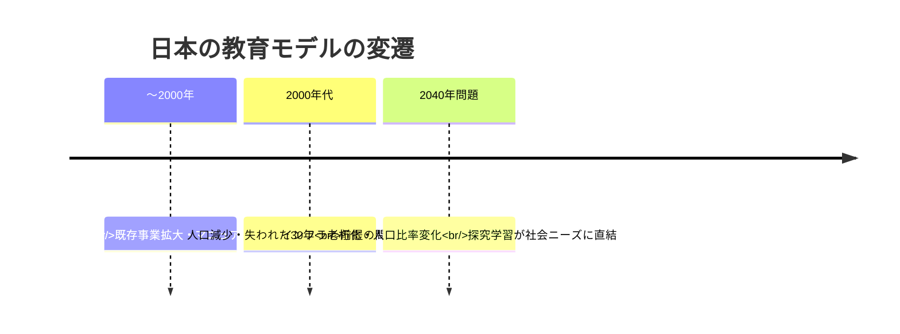
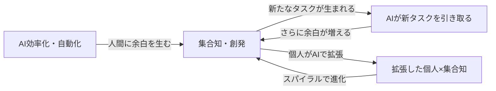
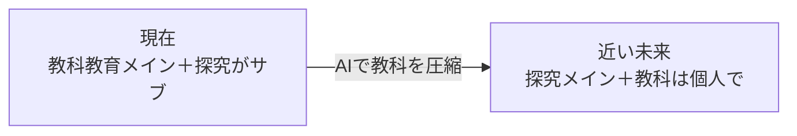
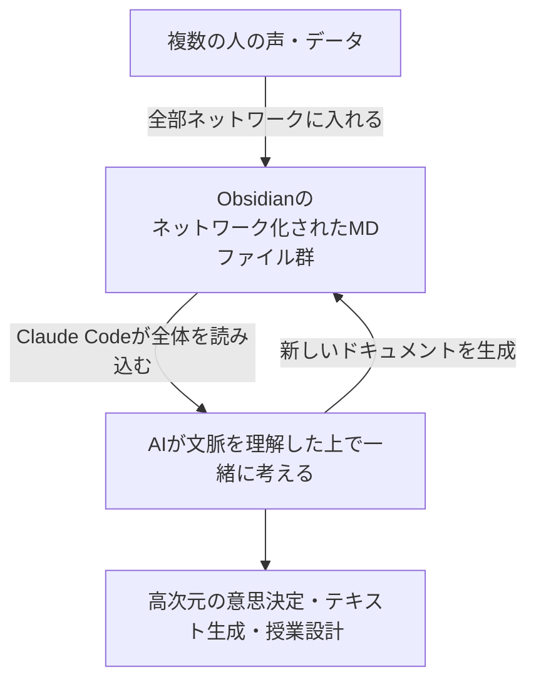
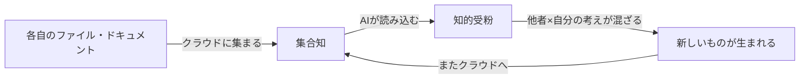
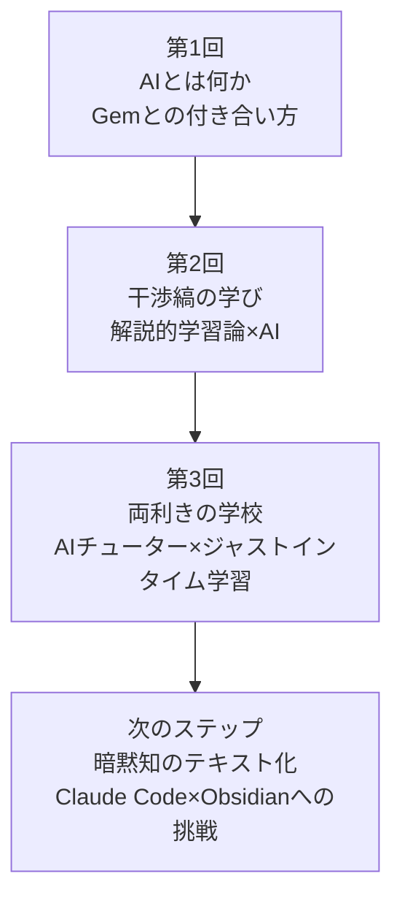

---
tags:
  - かえつ有明
  - AI研修
  - 両利きの学校
  - 両利きのAX
  - 探究学習
  - 創発・集合知
  - AIチューター
  - 反転授業
  - 個別最適化
  - ジャストインタイム学習
  - ClaudeCode
  - テクニカルファシリテーター
  - AI×教育
created: 2026-03-30
updated: 2026-03-31
---

# かえつ有明 AI研修 第3回レポート【最終版】

> **日時：** 2026年3月30日（月）09:00〜11:00
> **形式：** Zoom オンライン研修
> **ファシリテーター：** 田原さん（コンテンツ）× 北田朋也（テクニカル）
> **テーマ：** 両利きの学校 × AIチューター × ジャストインタイム学習
> **シリーズ：** AI時代の反転授業三本柱（全3回）最終回

---

## 全体の流れ

| 時刻 | 内容 |
|------|------|
| 09:03 | チェックイン |
| 09:10 | 本題①：両利きの学校（教科教育 vs 探究学習） |
| 09:15 | 本題②：両利きのAX（効率化 × 創発・集合知） |
| 09:19 | ワーク①：「今一番忙しいこと」フォーム入力（5分） |
| 09:25 | 北田事例：あおいカレッジ（やめるから始まった探究） |
| 09:28 | 田原事例：予備校時代の自己DX |
| 09:32 | フォーム回答まとめ・AI効率化領域の分類 |
| 09:36 | 本題③：AIチューターとは（カーンアカデミー・カーミーゴ） |
| 09:39 | 「何でもAIチューター」Gem ライブデモ（熱力学） |
| 09:42 | AIによるテキスト自動生成の可能性 |
| 09:45 | ワーク②：「何でもチューター」Gem 15分体験 |
| 10:00 | ブレークアウト：「授業デザインはどう変わるか」（15分） |
| 10:17 | グループ発表・全体ディスカッション |
| 10:36 | 発展：ジャストインタイム学習・Claude Code × Obsidian |
| 10:47 | 全体ディスカッション |
| 10:52 | チェックアウト |

---

## 参加者チェックイン（09:03〜09:10）

| 参加者 | 前回からのアップデート |
|--------|----------------------|
| 高田美喜さん | AI研修で「身近になった」。どう使えばいいか具体的に考えるようになってきた |
| 大木理恵子さん | 岩井先生・石田先生と一緒に**メール返信用のGemを自作・活用**中。「レベルは低いけど使ってます！」 |
| 上野愛さん | 「投げかけ（プロンプト）で結果が変わる」と実感 |
| 石田記子さん | Geminiを「道具として接する」に意識変容。AIを知るかどうかで時間の使い方が全然変わると痛感 |
| 山田秀男さん | **言語学・英語教育エキスパートとして設定**してGeminiに壁打ちを依頼。「読み込ませるもので差が出る。育てていかなきゃ」と体感 |
| 佐野和之さん | 授業への応用を学びたい。真逆の考えが統合されるプロセスに興味 |
| 立川さん | 第1回参加・第2回欠席。今日は新しいことを学びたい |
| 小島さん | 今回初参加。楽しみにしていた |
| 高倉さん | 今回初参加。ライトの使い方を学びたい |
| 岩井先生（チャット） | 教員・生徒のリテラシーをいかに育むか頭を悩ます毎日。授業設計への組み込みを考えている |
| 北田朋也 | 2回の実践を経て、リアルタイムで統合・アウトプットする「新しい研修の仕方」が見えてきた |

---

## 本題①：両利きの学校（09:10〜09:15）

```
既存事業（活用） = 教科教育         新規事業（探索） = 探究学習・PBL
─────────────────────────           ────────────────────────────────
人類が積み上げた知恵を体系化         答えのない問いを探索
後世に順番に学ばせる                 仮説を立てて検証・実験する
マニュアル通りに動ける人材育成       プロトタイプを小さく試す
```

### 人口動態と学校教育の転換



> **かえつ有明の立ち位置：** 田原さんの観察では、すでに「新しい学び（右側）」に向かう機運があり、両利きの学校を実践できる土台がある。

---

## 本題②：両利きのAX（09:15〜09:19）



> **田原：** 「AI効率化だけ進めると多様性が失われ長期的に組織が終わる。創発×AIのスパイラルを回すことが本質。」

---

## ワーク①：学校の忙しさ分析（09:19〜09:36）

### 忙しさの3カテゴリ

| カテゴリ | 内容 | AIで効率化できるか |
|----------|------|------------------|
| **直接的な生徒支援** | 子に寄り添う姿勢・個別対応 | △ 人間が担うべき |
| **組織運営・体制構築** | 新しい価値観を形にする「生みの苦しみ」 | △ 人間が担うべき |
| **ジム・ルーチンワーク** | 記録・集計・連絡調整・過去資料探し | ◎ 劇的に削減可能 |

> **反転授業の発明者バーグマン：**「反転授業で一番嬉しかったのは生徒同士・生徒と教師・教師同士のコミュニケーションが改善したこと」→ AIも同じ方向。**「何を減らして何を増やすか」が鍵。**

---

## 事例①：あおいカレッジ（北田朋也）（09:25〜09:27）

**「やめる」から始まった探究学習**

1. 若手教師が「クラブ活動、子どもたちイキイキしてなくないですか？」とポロっと発言
2. ベテランも薄々感じていたが言えずにいた → 全員が「そうだ」となった
3. クラブ活動を廃止 → **あおいカレッジ（探究学習）にシフト**
4. 派生した文化：「質の高い雑談タイム」「パーソナルタイム（音楽 = 集中作業の合図）」

---

## 事例②：田原さんの予備校時代の自己DX（09:28〜09:32）

| フェーズ | 状況 |
|----------|------|
| 当初 | 予習→授業の繰り返しで睡眠削り、新しいことをやる余力なし |
| 気づき | テキストは2年周期 → プリントを取っておけば再利用できる |
| 効率化 | スキャン → データベース化 → 自作テキスト化 |
| 5年後 | 予習不要の体制完成 → **空いた時間で副業（新規事業）スタート** |

> **「気づけば自分でDXして、空いた時間で新しいことを始めていた。まさに両利きの経営を自分でやっていた。」**

---

## 本題③：AIチューター（09:36〜09:45）

### カーンアカデミー & 何でもAIチューターGem

```
カーンアカデミー（Khan Academy）
 ├── Salman Khan が作った小〜高校レベルの学習サイト
 ├── 動画 → クイズ → 次のレベル、のコース学習
 └── カーミーゴ（Khanmigo）= 米国のみ実装中のAIチューター
```

> 田原さんの娘はカーンアカデミーで**小学6年生時に高校3年生レベルの数学を修了**。

田原さんがカーンアカデミーとGeminiを組み合わせて開発した**「何でもAIチューター」Gem** = チューターの原理だけを抽出。どんなテキスト・PDFでも対応。

### ライブデモ（熱力学）のポイント

> 「100Jの熱を加えたが外部に100Jの仕事をした。内部エネルギーは？」→「増えた」と答えると…
>
> チューター：「直感は大切です。では——**100円のお小遣いをもらって、すぐ100円のお菓子を買った。貯金は増えた？**」→「変わっていません」→「その通り！」

**間違いを否定せず、日常の例えで概念理解に導くソクラテス式対話の自動化。**

### AIによるテキスト自動生成

自分の過去資料をAI読み込み → 「田原流」でテキスト自動生成 → **高校物理全範囲が3日で完成**。大学範囲（解析力学）も全8講座生成。「自分より上手に教えてる（笑）」

### 個別最適学習の実装

```
生徒「こういうことを勉強したい」
        ↓
先生がコース・テキストをAIで即時生成
        ↓
テキスト ＋ AIチューターをセットで渡す
        ↓
生徒が自分のペースで学習を進める
（技術的にはすでに実装可能）
```

---

## ブレークアウト：授業デザインはどう変わるか（10:00〜10:17）

**問い：** AIによってコースやテキストを簡単に作ることができ、AIチューターが個別に学習支援できる環境になったら、授業デザインはどのように変わるのか

### ルーム1（高田・立川・岩井）

- **高田さん：** 個別の繰り返し質問対応に活用できる。立川先生のアイデア：**ライティングで「なぜこの意見は弱いのか」を対話式で教えてくれる**→「くるだけかと思ってたら、そこまでできると知って利用の幅が広がった」
- **岩井さん：** 「そもそも取り組んでくれるのか問題」→ フック作りや共同学習を生む仕組みが重要。AIで個別化が進む中、むしろ**人間のつながり・協働**に重きが置かれるようになる

> **田原（算数道場エピソード）：** 北田さんと取り組んだプロジェクトで「絶対に教えない」がルール。不登校傾向のある中1が比例定数Kを理解した日、夕食中に1時間お母さんに力説し続けた。**「チューターだけポイと渡してもやるわけじゃない。大人が見守っているからこそ進む」**

---

### ルーム2（山田・上野・石田）

- **上野さん：** データやソースの質でアウトプットが変わる。「育てていく・自分らしさを出す」感覚が大事。教科ごとの差の検証もあると良い

> **田原：** ティーチャーモード（先に説明）とチューターモード（問い返し）を**T/Cボタンで切り替えられるバージョン**も開発済み。みんなでチューターを作るとかえつスタイルのチューターが進化していく。

---

### ルーム3（佐野・北田・大木）

- **大木さん：** 佐野先生が「宮沢賢治と法華経の関係」を探求して**「やめたくなかった」**。普通の授業は「〇割の生徒がヒットするネタ」で設計するが、AIなら**「その子の入り口から入れる」**。生徒の探求が教師の専門性を超えたとき → **「全てを知っていなくてはいけない」マインドからの脱却が必要**
- **佐野さん：** 生徒がどこまで深めてきているかの**「見立て」**が必要。関心が低い子が置き去りになる可能性。「AIを使った授業設計はイメージできるが、それによって起こる次なる課題を捉えた設計が必要」

> **田原：** 生徒の探求が先生の理解を超える → **「先生も知らないなぁ、すごいね！」と言えることが生徒のモチベーションを上げる**。

---

### ルーム4（高倉・m_naoe・小島）

- **高倉さん：** どう使ったらいいかまだ正しい感覚が得られていない。**「画面の文字でしかない」感覚** → 対面とオンラインでは情報量が全然違う。「知った気になる」ことへの警戒
- **m_naoeさん：** 越境する社会課題にAIを使ったとき、グルーピングに**バイアスがかかっている違和感**を感じた。AIの提示に違和感を持ち続けることが正しい感覚。**「身体的理解」を並行してやらないと"知った気"の量産になる**
- **小島さん：** まだ慣れていない。どうやったら深まり、時間短縮につながるのかのイメージがまだない

---

## 発展：ジャストインタイム学習 & Claude Code × Obsidian（10:36〜10:47）

### 教育の重心逆転



> **シンガポールはすでにこちら側に完全移行。** ジャストインタイム学習（必要な知識を必要な分だけ、必要なときに）× ミッションベースドラーニングへ。

### 新規事業開発とAIの接続

> モヤモヤしたアイデアをAIに話すと、5〜10分で関連キーワードを探して調査レポートを生成。以前はコンサルに100万かけた調査がその日のうちに終わる。**「アイデアの10を100にするプロセス」こそ、探究学習で身につけるべきスキル。**

### Claude Code × Obsidian（田原さんが「クラウドコード」と呼んでいたもの）



> **田原：** 「ChatGPTやGeminiの10〜100倍の質のアウトプットが出る。テキストファイル群がネットワーク化されていれば、時代が変わってもそこから考え始められる。**かえつの先生方はこの環境の先頭チャレンジャーになれるかもしれない。**」

---

## 全体ディスカッション（10:47〜10:52）

**高倉さん：**
> 「文字でしかないと言ったが、変わるタイミングだとも感じている。人間は指も手も足も増えていない——限界はある。でも**その限界とは別の軸で道具が増えた**感覚。今まで見えなかったことが見えるようになる。自分なりの付き合い方を見つけたい。」

**田原さん：**
> 「今まで三方よしの構想は立てられたが十方よし・20方よしは頭がついていかなかった。この環境だと**十方よしの高次元構想**が作れる。今まで突破できなかった壁を突破できる喜びがある。ただ同じ技術がイランとアメリカの戦争でも使われている現実もある。**この技術を平和・人類の持続可能性のために使う若者を育てること**を考えている。」

**岩井先生：**
> 「かえつはGoogleワークスペース × Geminiがベース。先日の職員会議で『作ったものはGoogleドライブにあげてクラウド管理しましょう』と提案した。Claude Code × Obsidianは学校全体にはもう少し時間がかかるが、まずクラウドにデータを蓄積 → AIで分析という段階で進められそう。**暗黙知・明文化されていないルール・先生間で了解されているけど文字になっていないこと**をテキスト化した先に、違う活用が見えてくるかもしれない。」

**田原（コメント）：**



> 「これはオープンソース開発と同じ原理。**ドキュメントのオープンソース開発**が起きるようになった。『ファイル単体』から『ファイル群』で扱える時代になったことが今起きていること。」

---

## チェックアウト（10:52〜）

| 参加者 | 一言 |
|--------|------|
| **上野愛さん** | AIチューターで「なんでこんなことを聞いてくるんだろう」と思う瞬間が、逆に問いが生まれるきっかけに。自分では読まないものを引き出してくれる。生徒との関わりの中で活用していきたい |
| **石田記子さん** | 時間が増えてプラスになる反面、どんどん一人で解決すると人とのコミュニケーションが減るのでは？コロナ禍のマスク生活でコミュニケーションが減った中にさらにAIが入ることへの不安がある。スマホと同じ問いを感じている |
| **山田秀男さん** | 「自分の殻を溶かす可能性に、お鍋のイメージでワクワクしている」。一方で「自分のカラーに染めるためにAIを使い、子どもたちの創造性を恣意的に操作してしまう怖さ」も。**常にメタ的な視点が必要**。「ワクワクしながらも怖い、その両方がある」 |

---

## 3回シリーズを通じた学びの構造



> **北田（テクニカルファシリテーター）より：** 3回を通じて、参加者の皆さんがAIを「怖いもの」から「道具として接するもの」へ、そして「授業設計を根本から問い直す鏡」へと捉え方を変えていかれる様子をリアルタイムで記録できました。今回の研修そのものが「両利きのAX × 集合知」の実践でした。

---

## 関連ノート

- [[かえつ有明_AI研修第2回レポート_20260325]]
- [[KAEL_AI共創ファシリテーター_コンセプトレポート]]
