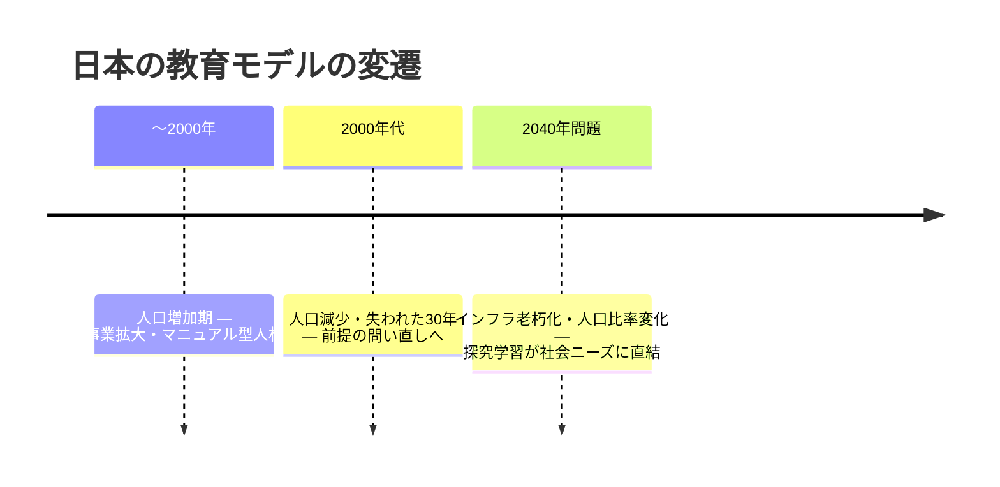
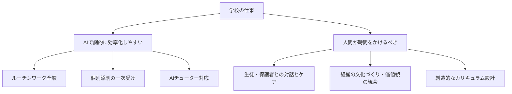
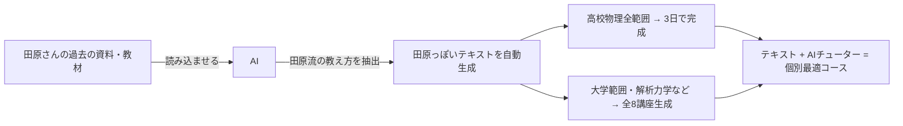

---
tags:
  - かえつ有明
  - AI研修
  - 両利きの学校
  - 両利きのAX
  - 探究学習
  - 創発・集合知
  - AIチューター
  - 反転授業
  - 個別最適化
  - テクニカルファシリテーター
  - AI×教育
created: 2026-03-30
updated: 2026-03-30
---

- [ ] 確認

# かえつ有明 AI研修 第3回レポート【記録中 🔴LIVE】

> **日時：** 2026年3月30日（月）09:00〜
> **形式：** Zoom オンライン研修
> **ファシリテーター：** 田原さん（コンテンツ）× 北田朋也（テクニカル）
> **テーマ：** 両利きの学校 × AIチューター — 何を減らして何を増やすか
> **シリーズ：** AI時代の反転授業三本柱（全3回）最終回

---

## 全体の流れ（記録中）

| 時刻 | 内容 |
|------|------|
| 09:03 | チェックイン（全員アップデート共有） |
| 09:10 | 本題①：両利きの学校（既存事業 = 教科教育 / 新規事業 = 探究学習） |
| 09:15 | 本題②：両利きのAX（効率化・自動化 × 創発・集合知） |
| 09:19 | ワーク①：「今一番忙しいこと」フォーム入力（5分） |
| 09:25 | 北田さん事例：あおいカレッジの改革（やめるから始まった探究学習） |
| 09:28 | 田原さん事例：予備校時代の自己DXで副業（新規事業）を生んだ話 |
| 09:32 | フォーム回答まとめ共有・AIで効率化できる領域の分類 |
| 09:36 | 本題③：AIチューターとは何か（カーンアカデミー・カーミーゴ） |
| 09:39 | AIチューター「何でも tutor」Gem ライブデモ（熱力学） |
| 09:42 | AIによるテキスト自動生成の可能性 |
| 09:45 | ワーク②：「何でもチューター」Gem を参加者各自で15分体験 |
| … | （随時更新中）|

---

## 参加者チェックイン（09:03〜09:10）

| 参加者 | 前回からのアップデート |
|--------|----------------------|
| 高田美喜さん | AI研修で「身近になった」。どう使えばいいか具体的に考えるようになってきた |
| 大木理恵子さん | 岩井先生・石田先生と一緒に**メール返信用のGemを自作・活用**中 |
| 上野愛さん | 声が回復。「投げかけ（プロンプト）で結果が変わる」と実感 |
| 石田記子さん | Geminiを「道具として接する」に意識変容。AIを知るかどうかで時間の使い方が全然変わると痛感 |
| 山田秀男さん | 言語学・英語教育エキスパートとして設定してGeminiに壁打ち。「読み込ませるもので差が出る」と体感 |
| 佐野和之さん | あまり深く考える時間がなかったが、授業への応用を学びたい |
| 立川さん | 第1回参加・第2回欠席。今日は新しいことを学びたい |
| 小島さん | 今回初参加。AI詳しくないが楽しみにしていた |
| 高倉さん | 今回初参加。ライトの使い方を学びたい |
| 岩井先生（チャット） | 教員・生徒のリテラシーをいかに育むか頭を悩ます毎日 |
| 北田朋也 | 2回の実践を経て、リアルタイムで統合・アウトプットする「新しい研修の仕方」が見えてきた |

---

## 本題①②：両利きの学校 × 両利きのAX（09:10〜09:19）

```
既存事業（活用） = 教科教育    新規事業（探索） = 探究学習・PBL
     ↓                                ↓
AI効率化・自動化で省力化     集合知・創発に人間の時間を集中
     ↓                                ↓
         → 両利きのAX = このスパイラルを回し続ける ←
```

### 人口動態と学校教育の転換



---

## ワーク①回答まとめ & AI活用分類（09:32〜09:36）

### 学校の忙しさ3カテゴリ

| カテゴリ | 内容 |
|----------|------|
| **直接的な生徒支援** | 子に寄り添う姿勢・個別対応 |
| **組織運営・体制構築** | 新しい価値観を形にする「生みの苦しみ」業務 |
| **ジム・ルーチンワーク** | 記録・集計・連絡調整・アナログ非効率・過去資料探し |

### AIで効率化できるか？



> **反転授業の発明者バーグマンの言葉：**「反転授業で一番嬉しかったのは**生徒同士・生徒と教師・教師同士のコミュニケーションが改善した**こと」→ AIでも同じことが起きる。

---

## 事例①：あおいカレッジ（北田朋也）（09:25〜09:27）

**「やめる」から始まった探究学習**

1. 若手教師が「クラブ活動、子どもたちイキイキしてなくないですか？」とポロっと発言
2. ベテランも薄々感じていたが言えずにいた → 全員が「そうだ」となった
3. クラブ活動を廃止 → **あおいカレッジ（探究学習）にシフト**
4. 派生した文化：「質の高い雑談タイム」「パーソナルタイム（音楽 = 集中作業の合図）」

---

## 事例②：田原さんの予備校時代の自己DX（09:28〜09:32）

| フェーズ | 状況 |
|----------|------|
| 当初 | 予習→授業の繰り返しで睡眠削り、新しいことをやる余力なし |
| 気づき | テキストは2年周期 → プリントを取っておけば再利用できる |
| 効率化 | スキャン → データベース化 → 自作テキスト化 |
| 5年後 | 予習不要の体制完成 → **空いた時間で副業（新規事業）スタート** |

---

## 本題③：AIチューターとは（09:36〜09:45）

### カーンアカデミーとカーミーゴ

```
カーンアカデミー（Khan Academy）
 ├── Salman Khan が作った小〜高校レベルの学習サイト
 ├── 動画 → クイズ → 次のレベルへ、のコース学習
 └── カーミーゴ（Khanmigo）= 米国のみ実装中のAIチューター
      動画を見てわからなかったらチューターと対話 → 理解が深まる
```

> 田原さんの娘はインターナショナルスクール在学中にカーンアカデミーを活用し、小学6年生で高校3年生レベルの数学まで修了。

### 田原さんの「何でもAIチューター」Gem

> カーンアカデミーを分析 + 慶応大学・線形代数チューター開発プロジェクトに参画 → **チューターの原理を抽出し「何でもAIチューター」Gemを自作**

**使い方：**
1. テキスト・PDFをアップロード（またはキーワードだけでもOK）
2. チューターが対話形式で学習をサポート

### ライブデモ：熱力学チューター（09:39〜09:41）

```
田原さん（生徒役）:「100Jの熱量を加えたが、外部に100Jの仕事をした。
                   内部エネルギーはどう変化した？」→「増えた。温度は上がった。」

チューター: 「直感的に熱を与えたからエネルギーが増えると考えたのですね。
             その感覚は大切です。では資料の数式に数字を当てはめてみましょう。
             Q=100、W=100、ΔUはいくつ？
             ——100円のお小遣いをもらって、すぐ100円のお菓子を買った。
               あなたの貯金は増えましたか？」

田原さん:「変わっていません」→ チューター:「その通りです！」
```

> **ポイント：** 間違いを否定せず、日常の例えで概念理解に導く。ソクラテス式対話の自動化。

### AIによるテキスト自動生成（09:42〜09:44）



> **田原：** 「自分が作ったことのない大学範囲の講座もAIが生成。自分より上手に教えてるので、それを勉強してみたりしてる（笑）」

### 個別最適学習の実装イメージ

```
生徒「こういうことを勉強したい」
        ↓
先生がコース・テキストをAIで即時生成
        ↓
テキスト ＋ AIチューターをセットで渡す
        ↓
生徒が自分のペースで学習を進める
（技術的にはすでに実装可能）
```

---

## ワーク②：「何でもチューター」Gem 体験（09:45〜）

> **田原：** 「15分間、皆さんが持っている資料や興味のあるキーワードで試してみてください。二次関数をやりたいと言えばそのチュータリングが始まります。チャットにリンクを貼りました。『始めます』と入力してスタート。」

（参加者の反応・感想は後ほど更新）

---

> ⏳ **このレポートは研修中リアルタイムで更新されています。**

---

## 関連ノート

- [[かえつ有明_AI研修第2回レポート_20260325]]
- [[KAEL_AI共創ファシリテーター_コンセプトレポート]]
