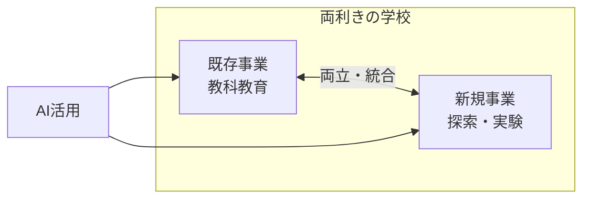

---
tags:
  - かえつ有明
  - AI研修
  - 両利きの学校
  - 両利きの経営
  - テクニカルファシリテーター
  - AI×教育
created: 2026-03-30
updated: 2026-03-30
---

- [ ] 確認

# かえつ有明 AI研修 第3回レポート【記録中 🔴LIVE】

> **日時：** 2026年3月30日（月）09:00〜
> **形式：** Zoom オンライン研修
> **ファシリテーター：** 田原さん（コンテンツ）× 北田朋也（テクニカル）
> **テーマ：** 両利きの学校 — AI時代の「探索」と「活用」の両立
> **シリーズ：** AI時代の反転授業三本柱（全3回）最終回

---

## 全体の流れ（記録中）

| 時刻 | 内容 |
|------|------|
| 09:03 | チェックイン（全員アップデート共有） |
| 09:10 | 本題：両利きの学校（既存事業×新規事業） |
| …  | （随時更新中）|

---

## 参加者チェックイン（09:03〜09:10）

| 参加者 | 前回からのアップデート |
|--------|----------------------|
| 高田美喜さん | AI研修で「身近になった」。どう使えばいいか具体的に考えるようになってきた |
| 大木理恵子さん | 岩井先生・石田先生と一緒に**メール返信用のGemを自作・活用**中。「レベルは低いけど使ってます！」 |
| 上野愛さん | 声が回復。岩井先生の講座など他の場でもAIに触れ、**「投げかけ（プロンプト）で結果が変わる」**と実感 |
| 石田記子さん | Geminiとの接し方が変化。以前は「お友達感覚」→ 研修後は**「道具として接する」**に。AIを知るか知らないかで時間の使い方が全然変わると痛感 |
| 山田秀男さん | **言語学・英語教育エキスパートとして設定**してGeminiに壁打ちを依頼。「読み込ませるもので差が出る」と体感。「これは育てていかなきゃ」という気持ちに |
| 佐野和之さん | あまり深く考える時間がなかったが、真逆の考えが統合されていくプロセスに興味。授業への応用を学びたい |
| 立川さん | 第1回参加・第2回欠席。先生方の「怖い話」を聞いて興味深い。今日は新しいことを学びたい |
| 小島さん | 今回初参加（1回・2回は予定が合わず）。AI詳しくないが楽しみにしていた |
| 高倉さん | 今回初参加（1回・2回参加できず）。ライトの使い方を学びたい |
| 岩井先生（チャット） | 教員・生徒のリテラシーをいかに育むか頭を悩ます毎日。授業設計への組み込みを考えている |
| 北田朋也 | 2回の実践を経て、**リアルタイムで統合・アウトプットする「新しい研修の仕方」**が見えてきた。最終回も楽しみ |

---

## 本題：両利きの学校（09:10〜）

### 両利きの経営とは？

```
既存事業（活用）               新規事業（探索）
─────────────────              ──────────────────
・決まった役割・仕事がある       ・いろんな可能性を探索する
・新入社員を育てて               ・プロトタイプを作り
  既存の仕事ができるようにする    　小さく試す
・効率化・最適化が目標            ・うまくいったら大きくする
```

> **ポイント：** 既存事業は社会の変化により「寿命」がある。だから既存事業を回しながら、**常に新規事業の探索を同時進行させる**のが「両利きの経営」。

### 学校への翻訳：両利きの学校

| 企業 | 学校 |
|------|------|
| 既存事業 | 教科教育（従来のカリキュラム） |
| 新規事業 | （記録中…） |
| 人材育成 | 教員研修・生徒育成 |

---



---

> ⏳ **このレポートは研修中リアルタイムで更新されています。**

---

## 関連ノート

- [[かえつ有明_AI研修第2回レポート_20260325]]
- [[KAEL_AI共創ファシリテーター_コンセプトレポート]]
