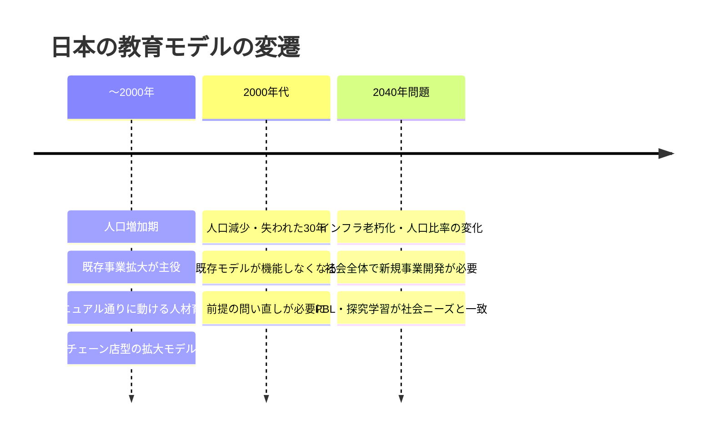
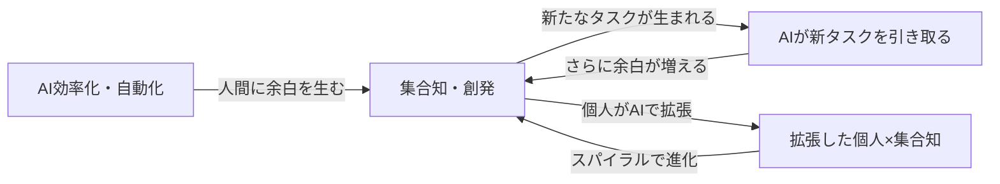

---
tags:
  - かえつ有明
  - AI研修
  - 両利きの学校
  - 両利きのAX
  - 探究学習
  - 創発・集合知
  - テクニカルファシリテーター
  - AI×教育
created: 2026-03-30
updated: 2026-03-30
---

- [ ] 確認

# かえつ有明 AI研修 第3回レポート【記録中 🔴LIVE】

> **日時：** 2026年3月30日（月）09:00〜
> **形式：** Zoom オンライン研修
> **ファシリテーター：** 田原さん（コンテンツ）× 北田朋也（テクニカル）
> **テーマ：** 両利きの学校 × 両利きのAX — AI時代の「創発」と「効率化」の両立
> **シリーズ：** AI時代の反転授業三本柱（全3回）最終回

---

## 全体の流れ（記録中）

| 時刻 | 内容 |
|------|------|
| 09:03 | チェックイン（全員アップデート共有） |
| 09:10 | 本題①：両利きの学校（既存事業 = 教科教育 / 新規事業 = 探究学習） |
| 09:15 | 本題②：両利きのAX（効率化・自動化 × 創発・集合知） |
| 09:19 | ワーク①：「今一番忙しいこと」フォーム入力（5分） |
| … | （随時更新中）|

---

## 参加者チェックイン（09:03〜09:10）

| 参加者 | 前回からのアップデート |
|--------|----------------------|
| 高田美喜さん | AI研修で「身近になった」。どう使えばいいか具体的に考えるようになってきた |
| 大木理恵子さん | 岩井先生・石田先生と一緒に**メール返信用のGemを自作・活用**中。「レベルは低いけど使ってます！」 |
| 上野愛さん | 声が回復。岩井先生の講座など他の場でもAIに触れ、**「投げかけ（プロンプト）で結果が変わる」**と実感 |
| 石田記子さん | Geminiとの接し方が変化。以前は「お友達感覚」→ 研修後は**「道具として接する」**に。AIを知るか知らないかで時間の使い方が全然変わると痛感 |
| 山田秀男さん | **言語学・英語教育エキスパートとして設定**してGeminiに壁打ちを依頼。「読み込ませるもので差が出る」と体感。「これは育てていかなきゃ」という気持ちに |
| 佐野和之さん | あまり深く考える時間がなかったが、真逆の考えが統合されていくプロセスに興味。授業への応用を学びたい |
| 立川さん | 第1回参加・第2回欠席。先生方の「怖い話」を聞いて興味深い。今日は新しいことを学びたい |
| 小島さん | 今回初参加（1回・2回は予定が合わず）。AI詳しくないが楽しみにしていた |
| 高倉さん | 今回初参加（1回・2回参加できず）。ライトの使い方を学びたい |
| 岩井先生（チャット） | 教員・生徒のリテラシーをいかに育むか頭を悩ます毎日。授業設計への組み込みを考えている |
| 北田朋也 | 2回の実践を経て、**リアルタイムで統合・アウトプットする「新しい研修の仕方」**が見えてきた。最終回も楽しみ |

---

## 本題①：両利きの学校（09:10〜09:15）

### 企業の「両利きの経営」とは

```
既存事業（活用）                   新規事業（探索）
─────────────────────────          ────────────────────────────
人類が積み上げた知恵を体系化        答えのない問いを探索
→ 後世に順番に学ばせる             仮説を立てて検証・実験する
→ マニュアル通りに動ける人材育成    プロトタイプを小さく試す
                                    うまくいったら拡大する
```

### 学校への翻訳

| 企業 | 学校 |
|------|------|
| 既存事業（活用） | **教科教育**（体系化された知識の継承） |
| 新規事業（探索） | **探究学習・PBL**（問いを立て検証する学び） |
| 人材育成 | 教員研修・生徒の資質育成 |

### 人口動態と学校教育の転換



> **かえつ有明の立ち位置：** 田原さんの観察では、かえつ有明はすでに「新しい学び（右側）」に向かう機運があり、両利きの学校を実践できる土台がある。

---

## 本題②：両利きのAX（AI Transformation）（09:15〜09:19）

### 2つのAI活用の方向性

```
両利きのAX
├── 効率化・自動化（左側）
│   人間の仕事をAIが置き換える
│   コストカット・生産性向上
│   ※これだけ進めると組織の多様性が失われ、長期的に会社が終わる
│
└── 創発・集合知（右側）
    多様な人の深い壁打ち → AI統合 → 集合知を生む
    個人がAIで拡張 → 拡張した個人が集合知を創る → スパイラル
    ※こちらに取り組む企業・学校はまだごく少数
```

### 正しい両利きのAXのサイクル



> **田原さんの視点：** 「創発と集合知を探求して30年。今AIが入ってきて、この両利きのAXを実践できる時代になった。効率化だけに走るのではなく、創発×AIのスパイラルを回すことが本質。」

### この研修での実践

> 一人一人が深く壁打ち → AIで統合・集合知化 → 個人がさらにAIで拡張 → また集合知へ
> ↑ これがかえつ有明研修でリアルタイムに起きていること

---

## ワーク①：「今一番忙しいこと」フォーム入力（09:19〜09:25）

> 田原さんより：「学校で何が一番時間を取られているか？まず聞いてみたい」
> → Googleフォームで5分間、各自記入中

| 問い |
|------|
| 仕事で今一番忙しいこと・時間を取られていることは何ですか？ |

（回答まとめは後ほど更新）

---

> ⏳ **このレポートは研修中リアルタイムで更新されています。**

---

## 関連ノート

- [[かえつ有明_AI研修第2回レポート_20260325]]
- [[KAEL_AI共創ファシリテーター_コンセプトレポート]]
