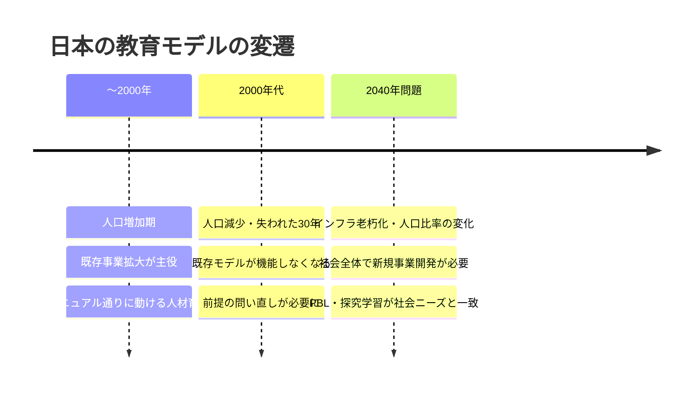
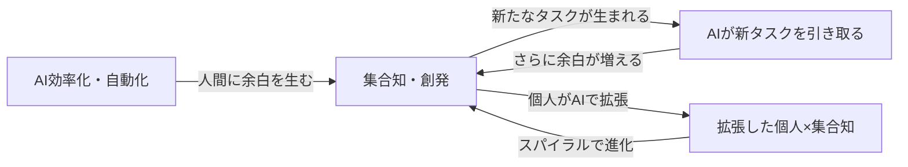
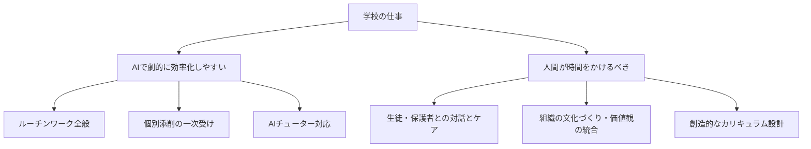

---
tags:
  - かえつ有明
  - AI研修
  - 両利きの学校
  - 両利きのAX
  - 探究学習
  - 創発・集合知
  - AIチューター
  - 反転授業
  - テクニカルファシリテーター
  - AI×教育
created: 2026-03-30
updated: 2026-03-30
---

- [ ] 確認

# かえつ有明 AI研修 第3回レポート【記録中 🔴LIVE】

> **日時：** 2026年3月30日（月）09:00〜
> **形式：** Zoom オンライン研修
> **ファシリテーター：** 田原さん（コンテンツ）× 北田朋也（テクニカル）
> **テーマ：** 両利きの学校 × AIチューター — 何を減らして何を増やすか
> **シリーズ：** AI時代の反転授業三本柱（全3回）最終回

---

## 全体の流れ（記録中）

| 時刻 | 内容 |
|------|------|
| 09:03 | チェックイン（全員アップデート共有） |
| 09:10 | 本題①：両利きの学校（既存事業 = 教科教育 / 新規事業 = 探究学習） |
| 09:15 | 本題②：両利きのAX（効率化・自動化 × 創発・集合知） |
| 09:19 | ワーク①：「今一番忙しいこと」フォーム入力（5分） |
| 09:25 | 北田さん事例：青いカレッジの改革（やめるから始まった探究学習） |
| 09:28 | 田原さん事例：予備校時代の自己DXで副業（新規事業）を生んだ話 |
| 09:32 | フォーム回答まとめ共有・AIで効率化できる領域の分類 |
| 09:36 | 本日の体験技術：**AIチューター** 紹介へ |
| … | （随時更新中）|

---

## 参加者チェックイン（09:03〜09:10）

| 参加者 | 前回からのアップデート |
|--------|----------------------|
| 高田美喜さん | AI研修で「身近になった」。どう使えばいいか具体的に考えるようになってきた |
| 大木理恵子さん | 岩井先生・石田先生と一緒に**メール返信用のGemを自作・活用**中。「レベルは低いけど使ってます！」 |
| 上野愛さん | 声が回復。岩井先生の講座など他の場でもAIに触れ、**「投げかけ（プロンプト）で結果が変わる」**と実感 |
| 石田記子さん | Geminiとの接し方が変化。以前は「お友達感覚」→ 研修後は**「道具として接する」**に。AIを知るか知らないかで時間の使い方が全然変わると痛感 |
| 山田秀男さん | **言語学・英語教育エキスパートとして設定**してGeminiに壁打ちを依頼。「読み込ませるもので差が出る」と体感。「これは育てていかなきゃ」という気持ちに |
| 佐野和之さん | あまり深く考える時間がなかったが、真逆の考えが統合されていくプロセスに興味。授業への応用を学びたい |
| 立川さん | 第1回参加・第2回欠席。先生方の「怖い話」を聞いて興味深い。今日は新しいことを学びたい |
| 小島さん | 今回初参加（1回・2回は予定が合わず）。AI詳しくないが楽しみにしていた |
| 高倉さん | 今回初参加（1回・2回参加できず）。ライトの使い方を学びたい |
| 岩井先生（チャット） | 教員・生徒のリテラシーをいかに育むか頭を悩ます毎日。授業設計への組み込みを考えている |
| 北田朋也 | 2回の実践を経て、**リアルタイムで統合・アウトプットする「新しい研修の仕方」**が見えてきた。最終回も楽しみ |

---

## 本題①：両利きの学校（09:10〜09:15）

```
既存事業（活用）                   新規事業（探索）
─────────────────────────          ────────────────────────────
人類が積み上げた知恵を体系化        答えのない問いを探索
→ 後世に順番に学ばせる             仮説を立てて検証・実験する
→ マニュアル通りに動ける人材育成    プロトタイプを小さく試す
                                    うまくいったら拡大する
  ＝ 教科教育                         ＝ 探究学習・PBL
```

### 人口動態と学校教育の転換



---

## 本題②：両利きのAX（09:15〜09:19）



> **田原さん：** 「AI効率化だけ進めると多様性が失われ長期的に組織が終わる。創発×AIのスパイラルを回すことが本質。創発と集合知を30年探求してきた。」

---

## ワーク①回答まとめ & AI活用分類（09:19〜09:36）

### 「今一番忙しいこと」3カテゴリ

| カテゴリ | 内容 |
|----------|------|
| **直接的な生徒支援・教育活動** | 子に寄り添う姿勢・個別対応 |
| **組織運営・体制構築** | 新しい価値観を形にするための「生みの苦しみ」業務 |
| **ジム・ルーチンワーク** | 記録・集計・連絡調整・アナログ非効率・過去資料探し |

### 忙しさを加速させる背景要因

- 予測不能性（突発対応）
- 人員不足・リソース不足
- 削れるはずの仕事が**慣習として残り続けている**

### AIで効率化できるか？



> **鍵：** AIで代替しにくい「人間らしい仕事」に時間を集中させるために、ルーチンをAIで効率化する。

---

## 事例①：あおいカレッジ（北田朋也）（09:25〜09:27）

> 田原さんより「北田さんが関わっていた青い小学校の改革事例を話してください」と求められて紹介。

**「やめる」から始まった探究学習**

1. 若手教師が働き方改革の会議で**「クラブ活動、子どもたちイキイキしてなくないですか？」** とポロっと発言
2. ベテランも薄々感じていたが言えずにいた → 全員が「そうだ」となった
3. クラブ活動を廃止 → **探究学習（あおいカレッジ）にシフト**
4. 派生的に生まれた文化：
   - **質の高い雑談タイム**（無駄話ではなく有意義な対話の時間）
   - **パーソナルタイム**（音楽が流れたら集中作業時間のサイン）

> **北田：** 「まずは『何が効率悪いか』『子どもたちのためになっていないか』の話し合いから始まった。やめることが新しい学びを生んだ。」

---

## 事例②：田原さんの予備校時代の自己DX（09:28〜09:32）

**「余白を作る」を自分で実践していた話**

| フェーズ | 状況 |
|----------|------|
| 当初 | 毎日予習→授業→予習→授業で睡眠削り。新しいことをやる余力なし |
| 気づき | 予備校テキストは2年周期で同じ → プリントを取っておけば再利用できる |
| 効率化 | プリントをA4整理 → スキャン → データベース化 → 自作テキスト化 |
| 5年後 | 予習不要の体制完成 → **空いた時間で副業（新規事業）をスタート** |

> **田原：** 「気づけば自分でDXして、紙からデータの世界にして効率化し、空いた時間で新しいことを始めていた。まさに両利きの経営を自分でやっていた。」

---

## 反転授業とAIの共通点（09:34〜09:36）

> 田原さんがジョナサン・バーグマン（反転授業の発明者）にスカイプインタビューした際の話。

**バーグマンの言葉：**
> 「反転授業によって私たちが達成できて一番嬉しかったのは、**生徒と生徒・生徒と教師・教師と教師のコミュニケーションが改善した**ことだ」

```
反転授業：一方的な講義を動画化 → 空いた授業時間を双方向コミュニケーションへ
AI活用：ルーチンをAI化 → 空いた時間をより人間らしい対話・ケアへ
                          ↓
             「何を減らして何を増やしたいか」が鍵
```

---

## 次のパート：AIチューター体験（09:36〜）

> 田原さん：「今日皆さんに体験してもらいたい技術がある。それは**AIチューター**です。」

（内容は随時更新）

---

> ⏳ **このレポートは研修中リアルタイムで更新されています。**

---

## 関連ノート

- [[かえつ有明_AI研修第2回レポート_20260325]]
- [[KAEL_AI共創ファシリテーター_コンセプトレポート]]
